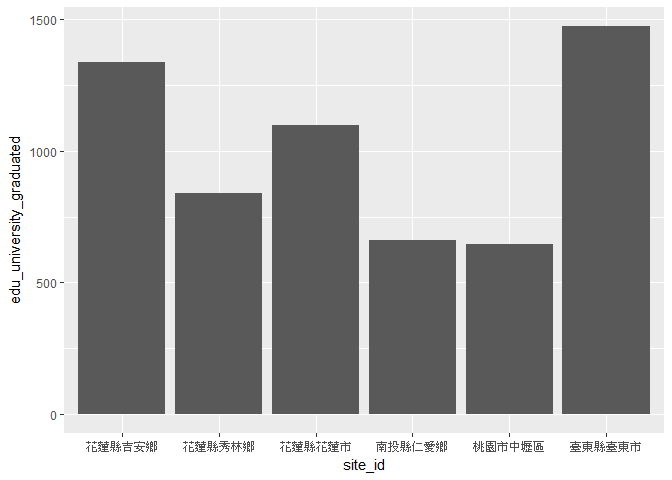

原住民與我們不同嗎?
================

組員
----

邱春敏 許晏慈

分析議題背景
------------

台灣居住著各種族群，其中原住民族約有55萬人，佔總人口數的2﹪，目前，經政府認定的原住民族有：阿美族、泰雅族、排灣族、布農族、卑南族、魯凱族、鄒族、賽夏族、雅美族、邵族、噶瑪蘭族、太魯閣族、撒奇萊雅族、賽德克族、拉阿魯哇族、卡那卡那富族等16族，每一族群居住位置分佈、人數、教育程度與婚姻狀況也有所不同。

分析動機
--------

原住民在台灣雖為較少數族群，但其人口數、教育程度、婚姻狀況的發展以及居住分布也是值得探討的議題，藉此也可觀察出關於原住民人口的動態，另外，我們將探討關於原住民人口與非原住民人口之生活型態是否有很大之差異。

使用資料
--------

1.現住原住民人口按性別、身分、原住民族別分 來源:政府資料開放平台 主要欄位:統計年月、區域別、村里、性別、身分、原住民族別 日期：105年09月

2.現住人口數按性別及原住民身分分 來源:政府資料開放平台 主要欄位:統計年月、區域別、村里、非原住民、平地原住民、山地原住民、性別 日期：105年09月

3.原住民人口按性別、年齡、原住民身分及婚姻狀況 來源:政府資料開放平台 主要欄位:統計年、區域別、村里、原住民身分、5歲年齡組、婚姻狀況、男性、女性 日期：105年

4.現住人口性別、年齡、婚姻狀況 來源:政府資料開放平台 主要欄位:統計年、區域別、村里、身分、5歲年齡組、婚姻狀況、男性、女性 日期：105年

5.15歲以上現住原住民人口數按性別、原住民身分及教育程度分 來源:政府資料開放平台 主要欄位:統計年、區域別、村里、總計、教育程度、平地原住民、山地原住民 日期：105年

假設
----

1.原住民大多居住在東部及山區 2.原住民20-29歲結婚比例偏鄉較高 3.原住民20-29歲未婚比例都市較高 4.原住民大學畢業人數大多在都市區域

載入使用資料們
--------------

``` r
#這是R Code Chunk
library(readr)
```

    ## Warning: package 'readr' was built under R version 3.3.3

``` r
opendata10509M070 <- read_csv("C:/Users/k451ln/Downloads/opendata10509M070.csv")
```

    ## Parsed with column specification:
    ## cols(
    ##   .default = col_character()
    ## )

    ## See spec(...) for full column specifications.

``` r
opendata10509M070 <- opendata10509M070[c(-1),]
View(opendata10509M070) #現住原住民人口按性別、身分、原住民族別分

library(readr)
opendata10509M020 <- read_csv("C:/Users/k451ln/Downloads/opendata10509M020.csv")
```

    ## Parsed with column specification:
    ## cols(
    ##   statistic_yyymm = col_character(),
    ##   site_id = col_character(),
    ##   village = col_character(),
    ##   people_total = col_character(),
    ##   people_total_m = col_character(),
    ##   naborigine_total_m = col_character(),
    ##   aborigine_plain_total_m = col_character(),
    ##   aborigine_mountain_total_m = col_character(),
    ##   people_total_f = col_character(),
    ##   naborigine_total_f = col_character(),
    ##   aborigine_plain_total_f = col_character(),
    ##   aborigine_mountain_total_f = col_character()
    ## )

``` r
opendata10509M020 <- opendata10509M020[c(-1),]
View(opendata10509M020) #現住人口數按性別及原住民身分分

library(readr)
opendata105Y090 <- read_csv("C:/Users/k451ln/Downloads/opendata105Y090.csv")
```

    ## Parsed with column specification:
    ## cols(
    ##   .default = col_character()
    ## )
    ## See spec(...) for full column specifications.

``` r
opendata105Y090 <- opendata105Y090[c(-1),]
View(opendata105Y090) #原住民人口按性別、年齡、原住民身分及婚姻狀況

library(readr)
opendata105Y030 <- read_csv("C:/Users/k451ln/Downloads/opendata105Y030.csv")
```

    ## Parsed with column specification:
    ## cols(
    ##   .default = col_character()
    ## )
    ## See spec(...) for full column specifications.

``` r
opendata105Y030 <- opendata105Y030[c(-1),]
View(opendata105Y030)
#現住人口性別、年齡、婚姻狀況

library(readr)
opendata10510M030 <- read_csv("G:/opendata10510M030.csv")
```

    ## Parsed with column specification:
    ## cols(
    ##   .default = col_character()
    ## )
    ## See spec(...) for full column specifications.

``` r
opendata10510M030 <- opendata10510M030[c(-1),]
View(opendata10510M030)##各年齡層人口總數

library(readr)
opendata105Y080 <- read_csv("C:/Users/k451ln/Downloads/opendata105Y080.csv")
```

    ## Parsed with column specification:
    ## cols(
    ##   .default = col_character()
    ## )
    ## See spec(...) for full column specifications.

``` r
opendata105Y080 <- opendata105Y080[c(-1),]
View(opendata105Y080) #15歲以上現住原住民人口數按性別、原住民身分及教育程度分

library(readr)
opendata105Y020 <- read_csv("G:/opendata105Y020.csv")
```

    ## Parsed with column specification:
    ## cols(
    ##   .default = col_character()
    ## )
    ## See spec(...) for full column specifications.

``` r
opendata105Y020 <- opendata105Y020[c(-1),]
View(opendata105Y020) #15歲以上現住人口數按性別、身分及教育程度分
```

資料處理與清洗
--------------

1.整理出各區域原住民之人數(aborigine) 2.整理出各區域平地原住民之人數(aborigine\_plain) 3.整理出各區域山地原住民之人數(aborigine\_mountain) 4.整理出各區域原住民總數(total) 5.20-29歲之間婚姻狀況(people\_marrige) 6.原住民20-29歲之間婚姻狀況(aborigine\_people\_marrige) 7.原住民大學畢業人數(aborigine\_edu)

處理資料

``` r
#這是R Code Chunk
library(dplyr)
```

    ## Warning: package 'dplyr' was built under R version 3.3.3

    ## 
    ## Attaching package: 'dplyr'

    ## The following objects are masked from 'package:stats':
    ## 
    ##     filter, lag

    ## The following objects are masked from 'package:base':
    ## 
    ##     intersect, setdiff, setequal, union

``` r
opendata10509M070$aborigine_amis_m <- as.numeric(opendata10509M070$aborigine_amis_m)#
opendata10509M070$aborigine_amis_f <- as.numeric(opendata10509M070$aborigine_amis_f)#
opendata10509M070$aborigine_atayal_m<-
  as.numeric(opendata10509M070$aborigine_atayal_m)#
opendata10509M070$aborigine_atayal_f<-
  as.numeric(opendata10509M070$aborigine_atayal_f)#
opendata10509M070$aborigine_paiwan_m<-
  as.numeric(opendata10509M070$aborigine_paiwan_m)#
opendata10509M070$aborigine_paiwan_f<-
  as.numeric(opendata10509M070$aborigine_paiwan_f)#
opendata10509M070$aborigine_bunun_m<-
  as.numeric(opendata10509M070$aborigine_bunun_m)#
opendata10509M070$aborigine_bunun_f<-
  as.numeric(opendata10509M070$aborigine_bunun_f)#
opendata10509M070$aborigine_rukai_m<-
  as.numeric(opendata10509M070$aborigine_rukai_m)#
opendata10509M070$aborigine_rukai_f<-
  as.numeric(opendata10509M070$aborigine_rukai_f)#
opendata10509M070$aborigine_puyuma_m<-
  as.numeric(opendata10509M070$aborigine_puyuma_m)#
opendata10509M070$aborigine_puyuma_f<-
  as.numeric(opendata10509M070$aborigine_puyuma_f)#
opendata10509M070$aborigine_tsou_m<-
  as.numeric(opendata10509M070$aborigine_tsou_m)
opendata10509M070$aborigine_tsou_f<-
  as.numeric(opendata10509M070$aborigine_tsou_f)
opendata10509M070$aborigine_saisiyat_m<-
  as.numeric(opendata10509M070$aborigine_saisiyat_m)
opendata10509M070$aborigine_saisiyat_f<-
  as.numeric(opendata10509M070$aborigine_saisiyat_f)
opendata10509M070$aborigine_yami_m<-
  as.numeric(opendata10509M070$aborigine_yami_m)
opendata10509M070$aborigine_yami_f<-
  as.numeric(opendata10509M070$aborigine_yami_f)
opendata10509M070$aborigine_thao_m<-
  as.numeric(opendata10509M070$aborigine_thao_m)
opendata10509M070$aborigine_thao_f<-
  as.numeric(opendata10509M070$aborigine_thao_f)
opendata10509M070$aborigine_kavalan_m<-
  as.numeric(opendata10509M070$aborigine_kavalan_m)
opendata10509M070$aborigine_kavalan_f<-
  as.numeric(opendata10509M070$aborigine_kavalan_f)
opendata10509M070$aborigine_truku_m<-
  as.numeric(opendata10509M070$aborigine_truku_m)
opendata10509M070$aborigine_truku_f<-
  as.numeric(opendata10509M070$aborigine_truku_f)
opendata10509M070$aborigine_sakizaya_m<-
  as.numeric(opendata10509M070$aborigine_sakizaya_m)
opendata10509M070$aborigine_sakizaya_f<-
  as.numeric(opendata10509M070$aborigine_sakizaya_f)
opendata10509M070$aborigine_sediq_m<-
  as.numeric(opendata10509M070$aborigine_sediq_m)
opendata10509M070$aborigine_sediq_f<-
  as.numeric(opendata10509M070$aborigine_sediq_f)
opendata10509M070$aborigine_hlaaluaavu_m<-
  as.numeric(opendata10509M070$aborigine_hlaaluaavu_m)
opendata10509M070$aborigine_hlaaluaavu_f<-
  as.numeric(opendata10509M070$aborigine_hlaaluaavu_f)
opendata10509M070$aborigine_kanakanavu_m<-
  as.numeric(opendata10509M070$aborigine_kanakanavu_m)
opendata10509M070$aborigine_kanakanavu_f<-
  as.numeric(opendata10509M070$aborigine_kanakanavu_f)

library(dplyr)
aborigine<-group_by(opendata10509M070,site_id)%>%
  summarise(
          aborigine_amis=sum(aborigine_amis_m,aborigine_amis_f),#阿美
          aborigine_atayal=sum(aborigine_atayal_m,aborigine_atayal_f),#泰雅
          aborigine_paiwan=sum(aborigine_paiwan_m,aborigine_paiwan_f),#排灣
          aborigine_bunun=sum(aborigine_bunun_m,aborigine_bunun_f),#布農
          aborigine_rukai=sum(aborigine_rukai_m,aborigine_rukai_f),#魯凱
          aborigine_puyuma=sum(aborigine_puyuma_m,aborigine_puyuma_f),#卑南
          aborigine_tsou=sum(aborigine_tsou_m,aborigine_tsou_f),#鄒族
          aborigine_saisiyat=sum(aborigine_saisiyat_m,aborigine_saisiyat_f),#賽夏族
          aborigine_yami=sum(aborigine_yami_m,aborigine_yami_f),#雅美族
          aborigine_thao=sum(aborigine_thao_m,aborigine_thao_f),#邵族
          aborigine_kavalan=sum(aborigine_kavalan_m,aborigine_kavalan_f),#噶瑪蘭族
          aborigine_truku=sum(aborigine_truku_m,aborigine_truku_f),#太魯閣族
          aborigine_sakizaya=sum(aborigine_sakizaya_m,aborigine_sakizaya_f),#撒奇萊雅族
          aborigine_sediq=sum(aborigine_sediq_m,aborigine_sediq_f),#賽德克族
          aborigine_hlaaluaavu=sum(aborigine_hlaaluaavu_m,aborigine_hlaaluaavu_f),#拉阿魯哇族
          aborigine_kanakanavu=sum(aborigine_kanakanavu_m,aborigine_kanakanavu_f)#卡那卡那富族
          
          )
View(aborigine)##原住民l


opendata10509M070$aborigine_plain_amis_m <- as.numeric(opendata10509M070$aborigine_plain_amis_m)#
opendata10509M070$aborigine_plain_amis_f <- as.numeric(opendata10509M070$aborigine_plain_amis_f)#
opendata10509M070$aborigine_plain_atayal_m<-
  as.numeric(opendata10509M070$aborigine_plain_atayal_m)#
opendata10509M070$aborigine_plain_atayal_f<-
  as.numeric(opendata10509M070$aborigine_plain_atayal_f)#
opendata10509M070$aborigine_plain_paiwan_m<-
  as.numeric(opendata10509M070$aborigine_plain_paiwan_m)#
opendata10509M070$aborigine_plain_paiwan_f<-
  as.numeric(opendata10509M070$aborigine_plain_paiwan_f)#
opendata10509M070$aborigine_plain_bunun_m<-
  as.numeric(opendata10509M070$aborigine_plain_bunun_m)#
opendata10509M070$aborigine_plain_bunun_f<-
  as.numeric(opendata10509M070$aborigine_plain_bunun_f)#
opendata10509M070$aborigine_plain_rukai_m<-
  as.numeric(opendata10509M070$aborigine_plain_rukai_m)#
opendata10509M070$aborigine_plain_rukai_f<-
  as.numeric(opendata10509M070$aborigine_plain_rukai_f)#
opendata10509M070$aborigine_plain_puyuma_m<-
  as.numeric(opendata10509M070$aborigine_plain_puyuma_m)#
opendata10509M070$aborigine_plain_puyuma_f<-
  as.numeric(opendata10509M070$aborigine_plain_puyuma_f)#
opendata10509M070$aborigine_plain_tsou_m<-
  as.numeric(opendata10509M070$aborigine_plain_tsou_m)
opendata10509M070$aborigine_plain_tsou_f<-
  as.numeric(opendata10509M070$aborigine_plain_tsou_f)
opendata10509M070$aborigine_plain_saisiyat_m<-
  as.numeric(opendata10509M070$aborigine_plain_saisiyat_m)
opendata10509M070$aborigine_plain_saisiyat_f<-
  as.numeric(opendata10509M070$aborigine_plain_saisiyat_f)
opendata10509M070$aborigine_plain_yami_m<-
  as.numeric(opendata10509M070$aborigine_plain_yami_m)
opendata10509M070$aborigine_plain_yami_f<-
  as.numeric(opendata10509M070$aborigine_plain_yami_f)
opendata10509M070$aborigine_plain_thao_m<-
  as.numeric(opendata10509M070$aborigine_plain_thao_m)
opendata10509M070$aborigine_plain_thao_f<-
  as.numeric(opendata10509M070$aborigine_plain_thao_f)
opendata10509M070$aborigine_plain_kavalan_m<-
  as.numeric(opendata10509M070$aborigine_plain_kavalan_m)
opendata10509M070$aborigine_plain_kavalan_f<-
  as.numeric(opendata10509M070$aborigine_plain_kavalan_f)
opendata10509M070$aborigine_plain_truku_m<-
  as.numeric(opendata10509M070$aborigine_plain_truku_m)
opendata10509M070$aborigine_plain_truku_f<-
  as.numeric(opendata10509M070$aborigine_plain_truku_f)
opendata10509M070$aborigine_plain_sakizaya_m<-
  as.numeric(opendata10509M070$aborigine_plain_sakizaya_m)
opendata10509M070$aborigine_plain_sakizaya_f<-
  as.numeric(opendata10509M070$aborigine_plain_sakizaya_f)
opendata10509M070$aborigine_plain_sediq_m<-
  as.numeric(opendata10509M070$aborigine_plain_sediq_m)
opendata10509M070$aborigine_plain_sediq_f<-
  as.numeric(opendata10509M070$aborigine_plain_sediq_f)
opendata10509M070$aborigine_plain_hlaaluaavu_m<-
  as.numeric(opendata10509M070$aborigine_plain_hlaaluaavu_m)
opendata10509M070$aborigine_plain_hlaaluaavu_f<-
  as.numeric(opendata10509M070$aborigine_plain_hlaaluaavu_f)
opendata10509M070$aborigine_plain_kanakanavu_m<-
  as.numeric(opendata10509M070$aborigine_plain_kanakanavu_m)
opendata10509M070$aborigine_plain_kanakanavu_f<-
  as.numeric(opendata10509M070$aborigine_plain_kanakanavu_f)

library(dplyr)
aborigine_plain<-group_by(opendata10509M070,site_id)%>%
  summarise(
          aborigine_plain_amis=sum(aborigine_plain_amis_m,aborigine_plain_amis_f),#阿美
          aborigine_plain_atayal=sum(aborigine_plain_atayal_m,aborigine_plain_atayal_f),#泰雅
          aborigine_plain_paiwan=sum(aborigine_plain_paiwan_m,aborigine_plain_paiwan_f),#排灣
          aborigine_plain_bunun=sum(aborigine_plain_bunun_m,aborigine_plain_bunun_f),#布農
          aborigine_plain_rukai=sum(aborigine_plain_rukai_m,aborigine_plain_rukai_f),#魯凱
          aborigine_plain_puyuma=sum(aborigine_plain_puyuma_m,aborigine_plain_puyuma_f),#卑南
          aborigine_plain_tsou=sum(aborigine_plain_tsou_m,aborigine_plain_tsou_f),#鄒族
          aborigine_plain_saisiyat=sum(aborigine_plain_saisiyat_m,aborigine_plain_saisiyat_f),#賽夏族
          aborigine_plain_yami=sum(aborigine_plain_yami_m,aborigine_plain_yami_f),#雅美族
          aborigine_plain_thao=sum(aborigine_plain_thao_m,aborigine_plain_thao_f),#邵族
          aborigine_plain_kavalan=sum(aborigine_plain_kavalan_m,aborigine_plain_kavalan_f),#噶瑪蘭族
          aborigine_plain_truku=sum(aborigine_plain_truku_m,aborigine_plain_truku_f),#太魯閣族
          aborigine_plain_sakizaya=sum(aborigine_plain_sakizaya_m,aborigine_plain_sakizaya_f),#撒奇萊雅族
          aborigine_plain_sediq=sum(aborigine_plain_sediq_m,aborigine_plain_sediq_f),#賽德克族
          aborigine_plain_hlaaluaavu=sum(aborigine_plain_hlaaluaavu_m,aborigine_plain_hlaaluaavu_f),#拉阿魯哇族
          aborigine_plain_kanakanavu=sum(aborigine_plain_kanakanavu_m,aborigine_plain_kanakanavu_f)#卡那卡那富族
          
          )
View(aborigine_plain)##平地原住民

opendata10509M070$aborigine_mountain_amis_m <- as.numeric(opendata10509M070$aborigine_mountain_amis_m)#
opendata10509M070$aborigine_mountain_amis_f <- as.numeric(opendata10509M070$aborigine_mountain_amis_f)#
opendata10509M070$aborigine_mountain_atayal_m<-
  as.numeric(opendata10509M070$aborigine_mountain_atayal_m)#
opendata10509M070$aborigine_mountain_atayal_f<-
  as.numeric(opendata10509M070$aborigine_mountain_atayal_f)#
opendata10509M070$aborigine_mountain_paiwan_m<-
  as.numeric(opendata10509M070$aborigine_mountain_paiwan_m)#
opendata10509M070$aborigine_mountain_paiwan_f<-
  as.numeric(opendata10509M070$aborigine_mountain_paiwan_f)#
opendata10509M070$aborigine_mountain_bunun_m<-
  as.numeric(opendata10509M070$aborigine_mountain_bunun_m)#
opendata10509M070$aborigine_mountain_bunun_f<-
  as.numeric(opendata10509M070$aborigine_mountain_bunun_f)#
opendata10509M070$aborigine_mountain_rukai_m<-
  as.numeric(opendata10509M070$aborigine_mountain_rukai_m)#
opendata10509M070$aborigine_mountain_rukai_f<-
  as.numeric(opendata10509M070$aborigine_mountain_rukai_f)#
opendata10509M070$aborigine_mountain_puyuma_m<-
  as.numeric(opendata10509M070$aborigine_mountain_puyuma_m)#
opendata10509M070$aborigine_mountain_puyuma_f<-
  as.numeric(opendata10509M070$aborigine_mountain_puyuma_f)#
opendata10509M070$aborigine_mountain_tsou_m<-
  as.numeric(opendata10509M070$aborigine_mountain_tsou_m)
opendata10509M070$aborigine_mountain_tsou_f<-
  as.numeric(opendata10509M070$aborigine_mountain_tsou_f)
opendata10509M070$aborigine_mountain_saisiyat_m<-
  as.numeric(opendata10509M070$aborigine_mountain_saisiyat_m)
opendata10509M070$aborigine_mountain_saisiyat_f<-
  as.numeric(opendata10509M070$aborigine_mountain_saisiyat_f)
opendata10509M070$aborigine_mountain_yami_m<-
  as.numeric(opendata10509M070$aborigine_mountain_yami_m)
opendata10509M070$aborigine_mountain_yami_f<-
  as.numeric(opendata10509M070$aborigine_mountain_yami_f)
opendata10509M070$aborigine_mountain_thao_m<-
  as.numeric(opendata10509M070$aborigine_mountain_thao_m)
opendata10509M070$aborigine_mountain_thao_f<-
  as.numeric(opendata10509M070$aborigine_mountain_thao_f)
opendata10509M070$aborigine_mountain_kavalan_m<-
  as.numeric(opendata10509M070$aborigine_mountain_kavalan_m)
opendata10509M070$aborigine_mountain_kavalan_f<-
  as.numeric(opendata10509M070$aborigine_mountain_kavalan_f)
opendata10509M070$aborigine_mountain_truku_m<-
  as.numeric(opendata10509M070$aborigine_mountain_truku_m)
opendata10509M070$aborigine_mountain_truku_f<-
  as.numeric(opendata10509M070$aborigine_mountain_truku_f)
opendata10509M070$aborigine_mountain_sakizaya_m<-
  as.numeric(opendata10509M070$aborigine_mountain_sakizaya_m)
opendata10509M070$aborigine_mountain_sakizaya_f<-
  as.numeric(opendata10509M070$aborigine_mountain_sakizaya_f)
opendata10509M070$aborigine_mountain_sediq_m<-
  as.numeric(opendata10509M070$aborigine_mountain_sediq_m)
opendata10509M070$aborigine_mountain_sediq_f<-
  as.numeric(opendata10509M070$aborigine_mountain_sediq_f)
opendata10509M070$aborigine_mountain_hlaaluaavu_m<-
  as.numeric(opendata10509M070$aborigine_mountain_hlaaluaavu_m)
opendata10509M070$aborigine_mountain_hlaaluaavu_f<-
  as.numeric(opendata10509M070$aborigine_mountain_hlaaluaavu_f)
opendata10509M070$aborigine_mountain_kanakanavu_m<-
  as.numeric(opendata10509M070$aborigine_mountain_kanakanavu_m)
opendata10509M070$aborigine_mountain_kanakanavu_f<-
  as.numeric(opendata10509M070$aborigine_mountain_kanakanavu_f)

library(dplyr)
aborigine_mountain<-group_by(opendata10509M070,site_id)%>%
  summarise(
          aborigine_mountain_amis=sum(aborigine_mountain_amis_m,aborigine_mountain_amis_f),#阿美
          aborigine_mountain_atayal=sum(aborigine_mountain_atayal_m,aborigine_mountain_atayal_f),#泰雅
          aborigine_mountain_paiwan=sum(aborigine_mountain_paiwan_m,aborigine_mountain_paiwan_f),#排灣
          aborigine_mountain_bunun=sum(aborigine_mountain_bunun_m,aborigine_mountain_bunun_f),#布農
          aborigine_mountain_rukai=sum(aborigine_mountain_rukai_m,aborigine_mountain_rukai_f),#魯凱
          aborigine_mountain_puyuma=sum(aborigine_mountain_puyuma_m,aborigine_mountain_puyuma_f),#卑南
          aborigine_mountain_tsou=sum(aborigine_mountain_tsou_m,aborigine_mountain_tsou_f),#鄒族
          aborigine_mountain_saisiyat=sum(aborigine_mountain_saisiyat_m,aborigine_mountain_saisiyat_f),#賽夏族
          aborigine_mountain_yami=sum(aborigine_mountain_yami_m,aborigine_mountain_yami_f),#雅美族
          aborigine_mountain_thao=sum(aborigine_mountain_thao_m,aborigine_mountain_thao_f),#邵族
          aborigine_mountain_kavalan=sum(aborigine_mountain_kavalan_m,aborigine_mountain_kavalan_f),#噶瑪蘭族
          aborigine_mountain_truku=sum(aborigine_mountain_truku_m,aborigine_mountain_truku_f),#太魯閣族
          aborigine_mountain_sakizaya=sum(aborigine_mountain_sakizaya_m,aborigine_mountain_sakizaya_f),#撒奇萊雅族
          aborigine_mountain_sediq=sum(aborigine_mountain_sediq_m,aborigine_mountain_sediq_f),#賽德克族
          aborigine_mountain_hlaaluaavu=sum(aborigine_mountain_hlaaluaavu_m,aborigine_mountain_hlaaluaavu_f),#拉阿魯哇族
          aborigine_mountain_kanakanavu=sum(aborigine_mountain_kanakanavu_m,aborigine_mountain_kanakanavu_f)#卡那卡那富族
          
          )
View(aborigine_mountain)##山地原住民

library(dplyr)
opendata10509M020$aborigine_plain_total_m <-
  as.numeric(opendata10509M020$aborigine_plain_total_m)
opendata10509M020$aborigine_mountain_total_m <-
  as.numeric(opendata10509M020$aborigine_mountain_total_m)
opendata10509M020$aborigine_plain_total_f <-
  as.numeric(opendata10509M020$aborigine_plain_total_f)
opendata10509M020$aborigine_mountain_total_f<-
  as.numeric(opendata10509M020$aborigine_mountain_total_f)
opendata10509M020$people_total <-
  as.numeric(opendata10509M020$people_total)
opendata10509M020$people_total_m <-
  as.numeric(opendata10509M020$people_total_m)
opendata10509M020$naborigine_total_m <-
  as.numeric(opendata10509M020$naborigine_total_m)
opendata10509M020$people_total_f <-
  as.numeric(opendata10509M020$people_total_f)
opendata10509M020$naborigine_total_f <-
  as.numeric(opendata10509M020$naborigine_total_f)


total<-aborigine_mountain<-group_by(opendata10509M020,site_id)%>%
  summarise(
    people_total=sum(people_total),
    people_total_m=sum(people_total_m),
    naborigine_total_m=sum(naborigine_total_m),
    aborigine_total_m=sum(aborigine_plain_total_m,aborigine_mountain_total_m),
    people_total_f=sum(people_total_f),
    naborigine_total_f=sum(naborigine_total_f),
    aborigine_total_f=sum(aborigine_plain_total_f,aborigine_mountain_total_f)
  )  #總人口數


library(dplyr)
opendata105Y030$single_age_20_24_m<-
  as.numeric(opendata105Y030$single_age_20_24_m)
opendata105Y030$single_age_25_29_m<-
  as.numeric(opendata105Y030$single_age_25_29_m)
opendata105Y030$single_age_20_24_f<-
  as.numeric(opendata105Y030$single_age_20_24_f)
opendata105Y030$single_age_25_29_f<-
  as.numeric(opendata105Y030$single_age_25_29_f)
opendata105Y030$married_20_24_m<-
  as.numeric(opendata105Y030$married_20_24_m)
opendata105Y030$married_25_29_m<-
  as.numeric(opendata105Y030$married_25_29_m)
opendata105Y030$married_20_24_f<-
  as.numeric(opendata105Y030$married_20_24_m)
opendata105Y030$married_25_29_f<-
  as.numeric(opendata105Y030$married_25_29_m)

people_marrige<-group_by(opendata105Y030,site_id)%>%
  summarise(
    single_age_20_29_m=sum(single_age_20_24_m,single_age_25_29_m),
    single_age_20_29_f=sum(single_age_20_24_f,single_age_25_29_f),
    single_age_sum=sum(single_age_20_24_m,single_age_25_29_m,single_age_20_24_f,single_age_25_29_f),
    married_20_29_m=sum(married_20_24_m,married_25_29_m),
    married_20_29_f=sum(married_20_24_f,married_25_29_f),
    married_sum=sum(married_20_24_m,married_25_29_m,married_20_24_f,married_25_29_f)
    
    
  )
#View(people_marrige)
##20-29歲之間婚姻狀況

library(dplyr)
opendata105Y090$aborigine_plain_single_age_20_24_m <-
  as.numeric(opendata105Y090$aborigine_plain_single_age_20_24_m)
opendata105Y090$aborigine_plain_single_age_25_29_m <-
  as.numeric(opendata105Y090$aborigine_plain_single_age_25_29_m)
opendata105Y090$aborigine_mountain_single_age_20_24_m<-
  as.numeric(opendata105Y090$aborigine_mountain_single_age_20_24_m)
opendata105Y090$aborigine_mountain_single_age_25_29_m<-
  as.numeric(opendata105Y090$aborigine_mountain_single_age_25_29_m)
opendata105Y090$aborigine_plain_single_age_20_24_f <-
  as.numeric(opendata105Y090$aborigine_plain_single_age_20_24_f)
opendata105Y090$aborigine_plain_single_age_25_29_f <-
  as.numeric(opendata105Y090$aborigine_plain_single_age_25_29_f)
opendata105Y090$aborigine_mountain_single_age_20_24_f<-
  as.numeric(opendata105Y090$aborigine_mountain_single_age_20_24_f)
opendata105Y090$aborigine_mountain_single_age_25_29_f<-
  as.numeric(opendata105Y090$aborigine_mountain_single_age_25_29_f)
opendata105Y090$aborigine_plain_divorced_age_20_24_m <-
  as.numeric(opendata105Y090$aborigine_plain_divorced_age_20_24_m)
opendata105Y090$aborigine_plain_divorced_age_25_29_m <-
  as.numeric(opendata105Y090$aborigine_plain_divorced_age_25_29_m)
opendata105Y090$aborigine_mountain_divorced_age_20_24_m<-
  as.numeric(opendata105Y090$aborigine_mountain_divorced_age_20_24_m)
opendata105Y090$aborigine_mountain_divorced_age_25_29_m<-
  as.numeric(opendata105Y090$aborigine_mountain_divorced_age_25_29_m)
opendata105Y090$aborigine_plain_divorced_age_20_24_f <-
  as.numeric(opendata105Y090$aborigine_plain_divorced_age_20_24_f)
opendata105Y090$aborigine_plain_divorced_age_25_29_f <-
  as.numeric(opendata105Y090$aborigine_plain_divorced_age_25_29_f)
opendata105Y090$aborigine_mountain_divorced_age_20_24_f<-
  as.numeric(opendata105Y090$aborigine_mountain_divorced_age_20_24_f)
opendata105Y090$aborigine_mountain_divorced_age_25_29_f<-
  as.numeric(opendata105Y090$aborigine_mountain_divorced_age_25_29_f)


aborigine_people_marrige<-group_by(opendata105Y090,site_id)%>%
  summarise(
   aborigine_single_age_20_29_m=sum(aborigine_plain_single_age_20_24_m,aborigine_plain_single_age_25_29_m,aborigine_mountain_single_age_20_24_m,aborigine_mountain_single_age_25_29_m),
   aborigine_single_age_20_29_f=sum(aborigine_plain_single_age_20_24_f,aborigine_plain_single_age_25_29_f,aborigine_mountain_single_age_20_24_f,aborigine_mountain_single_age_25_29_f),
    aborigine_single_sum=sum(aborigine_plain_single_age_20_24_m,aborigine_plain_single_age_25_29_m,aborigine_mountain_single_age_20_24_m,aborigine_mountain_single_age_25_29_m,aborigine_plain_single_age_20_24_f,aborigine_plain_single_age_25_29_f,aborigine_mountain_single_age_20_24_f,aborigine_mountain_single_age_25_29_f),
   aborigine_marriged_m=sum(aborigine_plain_divorced_age_20_24_m,aborigine_plain_divorced_age_25_29_m,aborigine_mountain_divorced_age_20_24_m,aborigine_mountain_divorced_age_25_29_m),
   aborigine_marriged_f=sum(aborigine_plain_divorced_age_20_24_f,aborigine_plain_divorced_age_25_29_f,aborigine_mountain_divorced_age_20_24_f,aborigine_mountain_divorced_age_25_29_f),
   aborigine_marriged_sum=sum(aborigine_plain_divorced_age_20_24_m,aborigine_plain_divorced_age_25_29_m,aborigine_mountain_divorced_age_20_24_m,aborigine_mountain_divorced_age_25_29_m,aborigine_plain_divorced_age_20_24_f,aborigine_plain_divorced_age_25_29_f,aborigine_mountain_divorced_age_20_24_f,aborigine_mountain_divorced_age_25_29_f)
   
  )
View(aborigine_people_marrige)
#原住民20-29歲之間婚姻狀況

join_marriged<-inner_join(people_marrige,aborigine_people_marrige,by="site_id")
View(join_marriged)

library(dplyr)
opendata105Y080$aborigine_plain_edu_university_graduated_m<- as.numeric(opendata105Y080$aborigine_plain_edu_university_graduated_m)
opendata105Y080$aborigine_mountain_edu_university_graduated_m<- as.numeric(opendata105Y080$aborigine_mountain_edu_university_graduated_m)
opendata105Y080$aborigine_plain_edu_university_graduated_f<- as.numeric(opendata105Y080$aborigine_plain_edu_university_graduated_f)
opendata105Y080$aborigine_mountain_edu_university_graduated_f<- as.numeric(opendata105Y080$aborigine_mountain_edu_university_graduated_f)

aborigine_edu<-group_by(opendata105Y080,site_id)%>%
  summarise(
    edu_m=sum(aborigine_plain_edu_university_graduated_m,aborigine_mountain_edu_university_graduated_m),
    edu_f=sum(aborigine_plain_edu_university_graduated_f,aborigine_mountain_edu_university_graduated_f),
    edu_sum=sum(aborigine_plain_edu_university_graduated_m,aborigine_mountain_edu_university_graduated_m,aborigine_plain_edu_university_graduated_f,aborigine_mountain_edu_university_graduated_f)
    
  )
View(aborigine_edu)
#原住民大學畢業人數


#knitr::kable(aborigine)
#knitr::kable(aborigine_plain)
#knitr::kable(aborigine_mountain)
#knitr::kable(total)
#knitr::kable(people_marrige)
#knitr::kable(aborigine_people_marrige)
#knitr::kable(aborigine_edu)
```

原住民居住範圍都在山區與東部區域
--------------------------------

由下圖可顯示出原住民人口數前15多之居住區域，可看出於原住民的確大多居住於山區及東部。

``` r
library(dplyr)
opendata10509M020$aborigine_plain_total_m<-
  as.numeric(opendata10509M020$aborigine_plain_total_m)
opendata10509M020$aborigine_mountain_total_m<-
  as.numeric(opendata10509M020$aborigine_mountain_total_m)
opendata10509M020$aborigine_plain_total_f<-
  as.numeric(opendata10509M020$aborigine_plain_total_f)
opendata10509M020$aborigine_mountain_total_f<-
  as.numeric(opendata10509M020$aborigine_mountain_total_f)
total<-group_by(opendata10509M020,site_id)%>%
  summarise(
    total_people=sum(aborigine_plain_total_m,aborigine_mountain_total_m,aborigine_plain_total_f,aborigine_mountain_total_f)
  )

aa<-head(total[order(total$total_people,decreasing= T),],15)
knitr::kable(aa)
```

| site\_id       |  total\_people|
|:---------------|--------------:|
| 臺東縣臺東市   |          21497|
| 花蓮縣吉安鄉   |          15208|
| 花蓮縣秀林鄉   |          13953|
| 南投縣仁愛鄉   |          12588|
| 花蓮縣花蓮市   |          12250|
| 南投縣信義鄉   |           9495|
| 桃園市中壢區   |           8320|
| 新竹縣尖石鄉   |           8213|
| 桃園市復興區   |           7943|
| 花蓮縣玉里鎮   |           7754|
| 臺東縣成功鎮   |           7674|
| 屏東縣三地門鄉 |           7301|
| 屏東縣來義鄉   |           7276|
| 桃園市桃園區   |           7276|
| 桃園市大溪區   |           7180|

``` r
library(ggmap)
```

    ## Warning: package 'ggmap' was built under R version 3.3.3

    ## Loading required package: ggplot2

    ## Warning: package 'ggplot2' was built under R version 3.3.3

``` r
twmap <- get_map(location = 'Taiwan',
                 zoom = 8,
                 language = "zh-TW")
```

    ## Map from URL : http://maps.googleapis.com/maps/api/staticmap?center=Taiwan&zoom=8&size=640x640&scale=2&maptype=terrain&language=zh-TW&sensor=false

    ## Information from URL : http://maps.googleapis.com/maps/api/geocode/json?address=Taiwan&sensor=false

``` r
ggmap(twmap)+
  geom_point(aes(x=121.095509,
                 y=22.750561),
             color="red",size=5)+
 geom_point(aes(x=121.568517,
                 y=23.941033), 
             color="red",size=5)+
 geom_point(aes(x=121.472991,
                 y=24.128959), 
             color="red",size=5)+
 geom_point(aes(x=121.143455,
                 y=24.048777), 
             color="red",size=5)+
 geom_point(aes(x=121.610602,
                 y=23.989400),
             color="red",size=5)+
 geom_point(aes(x=23.680020,
                 y=121.019792),
             color="red",size=5)+
 geom_point(aes(x=121.205067,
                 y=24.976763),
             color="red",size=5)+
 geom_point(aes(x=121.284845,
                 y=24.584487), 
             color="red",size=5)+
 geom_point(aes(x=121.382167,
                 y=24.738582),
             color="red",size=5)+
 geom_point(aes(x=121.368624,
                 y=23.374986),
             color="red",size=5)+
 geom_point(aes(x=121.339663,
                 y=23.111476),
             color="red",size=5)+
 geom_point(aes(x=121.284845,
                 y=24.584487), 
             color="red",size=5)+
 geom_point(aes(x=120.690975,
                 y=22.804590),
             color="red",size=5)+
 geom_point(aes(x=120.677111,
                 y=22.501993),
             color="red",size=5)+
 geom_point(aes(x=121.300109,
                 y=24.999656),
             color="red",size=5)+
 geom_point(aes(x=121.296645,
                 y=24.874782),
             color="red",size=5)
```

    ## Warning: Removed 4 rows containing missing values (geom_point).



非原住民人口大多居住地
----------------------

以下可計算出非原住民人口大多居住地位於何處，並以地圖顯示出非原住民人口居住地人數前15高之區域。

``` r
library(dplyr)
opendata10509M020$naborigine_total_m<-
  as.numeric(opendata10509M020$naborigine_total_m)
opendata10509M020$naborigine_total_f<-
  as.numeric(opendata10509M020$naborigine_total_f)
the_people<-group_by(opendata10509M020,site_id)%>%
  summarise(
    no_ab=sum(naborigine_total_m,naborigine_total_f)
  )
View(the_people)

bb<-head(the_people[order(the_people$no_ab,decreasing= T),],15)
knitr::kable(bb)
```

| site\_id     |  no\_ab|
|:-------------|-------:|
| 新北市板橋區 |  548161|
| 桃園市桃園區 |  425040|
| 新北市中和區 |  411346|
| 新北市新莊區 |  408509|
| 桃園市中壢區 |  386101|
| 新北市三重區 |  385961|
| 臺北市大安區 |  310401|
| 新北市新店區 |  297279|
| 臺北市士林區 |  288409|
| 臺北市內湖區 |  285069|
| 臺北市文山區 |  273202|
| 臺中市北屯區 |  266435|
| 高雄市三民二 |  263289|
| 臺北市北投區 |  255831|
| 新北市土城區 |  234125|

``` r
library(ggmap)
twmap <- get_map(location = 'Taiwan',
                 zoom = 8,
                 language = "zh-TW")
```

    ## Map from URL : http://maps.googleapis.com/maps/api/staticmap?center=Taiwan&zoom=8&size=640x640&scale=2&maptype=terrain&language=zh-TW&sensor=false

    ## Information from URL : http://maps.googleapis.com/maps/api/geocode/json?address=Taiwan&sensor=false

``` r
ggmap(twmap)+
  geom_point(aes(x=121.459159,
                 y=25.007179),
             color="red",size=5)+
 geom_point(aes(x=121.301139,
                y=24.999345),
             color="red",size=5)+
 geom_point(aes(x=121.487530,
                y=24.992929), 
             color="red",size=5)+
 geom_point(aes(x=121.423334,
                y=25.024744), 
             color="red",size=5)+
 geom_point(aes(x=121.203007,
                y=24.985165),
            color="red",size=5)+
geom_point(aes(x=121.481396,
                 y=25.064055),
             color="red",size=5)+
 geom_point(aes(x=121.539898,
                 y=25.020007),
             color="red",size=5)+
 geom_point(aes(x=121.541864,
                y=24.978484), 
             color="red",size=5)+
 geom_point(aes(x=121.521473,
                 y=25.090994),
             color="red",size=5)+
 geom_point(aes(x= 121.568748,
                y=24.988003),
             color="red",size=5)+
 geom_point(aes(x=121.563833,
                y=24.991511),
             color="red",size=5)+

 geom_point(aes(x=120.684602,
                 y=24.185790),
             color="red",size=5)+
 geom_point(aes(x=120.324985,
                 y=22.652488),
             color="red",size=5)+
 geom_point(aes(x=121.517990,
                 y=25.128861),
             color="red",size=5)+
 geom_point(aes(x=121.436971,
                 y=24.971578),
             color="red",size=5)
```


20-29歲之間婚姻狀況(已婚)
-------------------------

以下算出原住民20-29歲男女生已婚， 並且顯示出原住民20-29歲已婚總比例前六高之區域名稱， 由計算結果可得知已婚總比例前六高的區域皆不是位於台灣最繁華的縣市區域。

``` r
library(dplyr)
join_marriged$aborigine_marriged_m<-
  as.numeric(join_marriged$aborigine_marriged_m)
join_marriged$married_20_29_m<-
  as.numeric(join_marriged$married_20_29_m)
join_marriged$aborigine_marriged_f<-
  as.numeric(join_marriged$aborigine_marriged_f)
join_marriged$married_20_29_f<-
  as.numeric(join_marriged$married_20_29_f)
join_marriged$aborigine_marriged_sum<-
  as.numeric(join_marriged$aborigine_marriged_sum)
join_marriged$married_sum<-
  as.numeric(join_marriged$married_sum)

Rate_Marriged <- group_by(join_marriged,site_id)%>%
  summarise(
         "已婚男生比例"=aborigine_marriged_m/married_20_29_m,
         "已婚女生比例"=aborigine_marriged_f/married_20_29_f,
         total_marriged_rate=aborigine_marriged_sum/married_sum
         )
#View(Rate_Marriged)

Rate_Marriged<-arrange(Rate_Marriged,
       desc(total_marriged_rate))
Rate_Marriged_h<-head(Rate_Marriged)
knitr::kable(Rate_Marriged_h)
```

| site\_id       | 已婚男生比例 | 已婚女生比例 |  total\_marriged\_rate|
|:---------------|:------------:|:------------:|----------------------:|
| 屏東縣三地門鄉 |   1.0000000  |       0      |              0.5000000|
| 屏東縣霧臺鄉   |   1.0000000  |       0      |              0.5000000|
| 臺東縣金峰鄉   |   1.0000000  |       0      |              0.5000000|
| 臺東縣海端鄉   |   1.0000000  |       0      |              0.5000000|
| 屏東縣來義鄉   |   0.9886364  |       0      |              0.4943182|
| 新竹縣五峰鄉   |   0.9836066  |       0      |              0.4918033|

``` r
library(ggmap)
twmap <- get_map(location = 'Taiwan',
                 zoom = 8,
                 language = "zh-TW")
```

    ## Map from URL : http://maps.googleapis.com/maps/api/staticmap?center=Taiwan&zoom=8&size=640x640&scale=2&maptype=terrain&language=zh-TW&sensor=false

    ## Information from URL : http://maps.googleapis.com/maps/api/geocode/json?address=Taiwan&sensor=false

``` r
ggmap(twmap)+
  geom_point(aes(x=120.690288,
                 y=22.813768),
             color="red",size=5)+
 geom_point(aes(x=120.776190,
                 y=22.747447),
             color="red",size=5)+
 geom_point(aes(x=120.873542,
                 y=22.561983),
             color="red",size=5)+
 geom_point(aes(x=121.035152,
                 y=23.103352,size=5), 
             color="red",size=5)+
 geom_point(aes(x=120.682947,
                 y=22.499455),
             color="red",size=5)+
 geom_point(aes(x=121.140927,
                 y=24.586937),
             color="red",size=5)
```


20-29歲之間婚姻狀況(未婚)
-------------------------

以下算出原住民20-29歲男女生未婚比例， 並且顯示出原住民20-29歲未婚總比例前六高之區域名稱， 由計算結果可得未婚總比例前六高的區域皆不是位於台灣最繁華的縣市區域。

``` r
library(dplyr)
join_marriged$single_age_20_29_m<-
  as.numeric(join_marriged$single_age_20_29_m)
join_marriged$single_age_20_29_f<-
  as.numeric(join_marriged$single_age_20_29_f)
join_marriged$aborigine_single_age_20_29_m<-
  as.numeric(join_marriged$aborigine_single_age_20_29_m)
join_marriged$aborigine_single_age_20_29_f<-
  as.numeric(join_marriged$aborigine_single_age_20_29_f)
join_marriged$aborigine_single_sum<-
  as.numeric(join_marriged$aborigine_single_sum)
join_marriged$single_sum<-
  as.numeric(join_marriged$single_age_sum)
Rate_Single <- group_by(join_marriged,site_id)%>%
  summarise(
        
         "未婚男生比例"=aborigine_single_age_20_29_m/single_age_20_29_m,
         "未婚女生比例"=aborigine_single_age_20_29_f/single_age_20_29_f,
         total_rate_single=aborigine_single_sum/single_age_sum
         
         )

Rate_Single<-arrange(Rate_Single,
       desc(total_rate_single))
Rate_Single_h<-head(Rate_Single)
knitr::kable(Rate_Single_h)
```

| site\_id       | 未婚男生比例 | 未婚女生比例 |  total\_rate\_single|
|:---------------|:------------:|:------------:|--------------------:|
| 臺東縣達仁鄉   |   0.9688716  |   0.0348837  |            0.5944056|
| 新竹縣尖石鄉   |   0.9264957  |   0.0621891  |            0.5744681|
| 屏東縣泰武鄉   |   0.9942029  |   0.0367647  |            0.5721232|
| 高雄市那瑪夏區 |   0.9333333  |   0.0617284  |            0.5684755|
| 花蓮縣卓溪鄉   |   0.9832636  |   0.0246575  |            0.5682088|
| 宜蘭縣大同鄉   |   0.8959538  |   0.0458716  |            0.5673759|

``` r
#View(Rate_Single)

library(ggmap)
twmap <- get_map(location = 'Taiwan',
                 zoom = 8,
                 language = "zh-TW")
```

    ## Map from URL : http://maps.googleapis.com/maps/api/staticmap?center=Taiwan&zoom=8&size=640x640&scale=2&maptype=terrain&language=zh-TW&sensor=false

    ## Information from URL : http://maps.googleapis.com/maps/api/geocode/json?address=Taiwan&sensor=false

``` r
ggmap(twmap)+
  geom_point(aes(x=120.829198,
                 y=22.389546),
             color="red",size=5)+
 geom_point(aes(x=121.288965,
                 y=24.596974),
             color="red",size=5)+
 geom_point(aes(x=120.686778,
                 y=22.607390),
             color="red",size=5)+
 geom_point(aes(x=120.728842,
                 y=23.267453),
             color="red",size=5)+
 geom_point(aes(x=121.178131,
                 y=23.414802),
             color="red",size=5)+
 geom_point(aes(x=121.494581,
                 y=24.555491), 
             color="red",size=5)
```


原住民大學畢業人數
------------------

以下算出原住民大學畢業男女生人數與總數，可得知原住民大學畢業人數前六多人的縣市區域為台東縣台東市、花蓮縣吉安鄉、花蓮縣花蓮市、花蓮縣秀林鄉、南投仁愛鄉、桃園市中壢區。大多位於東部及山區，較特別的是畢業人數第六多位於桃園市中壢區，相較於前五筆資料，其屬於較繁華之區域。

``` r
aborigine_edu<-arrange(aborigine_edu,
       desc(edu_sum))
#View(aborigine_edu)
aborigine_edu_h<-head(aborigine_edu)


knitr::kable(aborigine_edu_h)
```

| site\_id     |  edu\_m|  edu\_f|  edu\_sum|
|:-------------|-------:|-------:|---------:|
| 臺東縣臺東市 |     619|     855|      1474|
| 花蓮縣吉安鄉 |     637|     700|      1337|
| 花蓮縣花蓮市 |     416|     683|      1099|
| 花蓮縣秀林鄉 |     392|     449|       841|
| 南投縣仁愛鄉 |     285|     376|       661|
| 桃園市中壢區 |     244|     401|       645|

``` r
library(ggplot2)
library(datasets)
g<-ggplot(aborigine_edu_h,
                  aes(x=site_id,y=edu_sum,
                  fill=site_id) )
g+ geom_bar(stat="identity") +
  scale_fill_brewer(palette="Set2") +
  theme_classic()
```


原住民大學畢業人數男女之區別
----------------------------

以下可顯示出原住民人口大學畢業人數前六高之區域其男女人數各占多少，由下圖可明顯看出這六個區域明顯的女生畢業人數較男生多。

``` r
library(ggplot2)
library(datasets)

library(readr)
abc <- read_csv("C:/Users/k451ln/Desktop/abc.csv")
```

    ## Parsed with column specification:
    ## cols(
    ##   site_id = col_character(),
    ##   sex = col_integer(),
    ##   people = col_integer()
    ## )

``` r
abc[1,1]<-"臺東縣臺東市"
abc[2,1]<-"臺東縣臺東市"
abc[3,1]<-"花蓮縣吉安鄉"
abc[4,1]<-"花蓮縣吉安鄉"
abc[5,1]<-"花蓮縣花蓮市"
abc[6,1]<-"花蓮縣花蓮市"
abc[7,1]<-"花蓮縣秀林鄉"
abc[8,1]<-"花蓮縣秀林鄉"
abc[9,1]<-"南投縣仁愛鄉"
abc[10,1]<-"南投縣仁愛鄉"
abc[11,1]<-"桃園市中壢區"
abc[12,1]<-"桃園市中壢區"
#View(abc)

 
ggplot(abc, aes(x = site_id, y = people, fill = sex)) + geom_bar(stat = "identity")
```


非原住民大學畢業之人數
----------------------

以下可計算出非原住民之大學畢業人數，並且顯示出前六多大學畢業人數之區域，由下表可得知大多位於台灣較都市區域。

``` r
library(dplyr)
opendata105Y020$edu_university_graduated_m<-
  as.numeric(opendata105Y020$edu_university_graduated_m)
opendata105Y020$edu_university_graduated_f<-
  as.numeric(opendata105Y020$edu_university_graduated_f)

edu_gr <- group_by(opendata105Y020,site_id)%>%
  summarise(
        edu_m=sum(edu_university_graduated_m),
        edu_f=sum(edu_university_graduated_f),
         total_edu=sum(edu_university_graduated_m,edu_university_graduated_f)
         
         )
edu_grr<-arrange(edu_gr,
       desc(total_edu))

edu_grrr<-head(edu_grr)


knitr::kable(edu_grrr)
```

| site\_id     |  edu\_m|  edu\_f|  total\_edu|
|:-------------|-------:|-------:|-----------:|
| 新北市板橋區 |   45400|   51441|       96841|
| 臺北市大安區 |   41032|   48143|       89175|
| 桃園市桃園區 |   37585|   41000|       78585|
| 新北市中和區 |   37661|   40815|       78476|
| 臺北市內湖區 |   32411|   37580|       69991|
| 桃園市中壢區 |   33960|   35343|       69303|

``` r
library(ggplot2)
library(datasets)
f<-ggplot(edu_grrr,
                  aes(x=site_id,y=total_edu,
                  fill=site_id) )
f+ geom_bar(stat="identity") +
  scale_fill_brewer(palette="Set2") +
  theme_classic()
```


非原住民人口大學畢業人數男女之區別
----------------------------------

以下可顯示出非原住民人口大學畢業人數前六高之區域其男女人數各占多少，由下圖可明顯看出這六個區域明顯的女生畢業人數較男生多。

``` r
library(ggplot2)
library(datasets)

library(readr)
abcd <- read_csv("C:/Users/k451ln/Desktop/abc.csv")
```

    ## Parsed with column specification:
    ## cols(
    ##   site_id = col_character(),
    ##   sex = col_integer(),
    ##   people = col_integer()
    ## )

``` r
abcd[1,1]<-"新北市板橋區"
abcd[2,1]<-"新北市板橋區"
abcd[3,1]<-"臺北市大安區"
abcd[4,1]<-"臺北市大安區"
abcd[5,1]<-"桃園市桃園區"
abcd[6,1]<-"桃園市桃園區"
abcd[7,1]<-"新北市中和區"
abcd[8,1]<-"新北市中和區"
abcd[9,1]<-"臺北市內湖區"
abcd[10,1]<-"臺北市內湖區"
abcd[11,1]<-"桃園市中壢區"
abcd[12,1]<-"桃園市中壢區"
#View(abc)

 
ggplot(abcd, aes(x = site_id, y = people, fill = sex)) + geom_bar(stat = "identity")
```


期末專題之結論
--------------

透過此次期末專題研究我們可以觀察出原住民人口主要居住地、受教育程度甚至 是婚姻狀況，雖然我們所統計的資料量並不大，但可透過此次研究了解一下原住民的生活型態比我們是否相同又或者有很大的差異。雖然研究後的結果與原本假設的狀況有些需許不同，但也算是長知識了。
